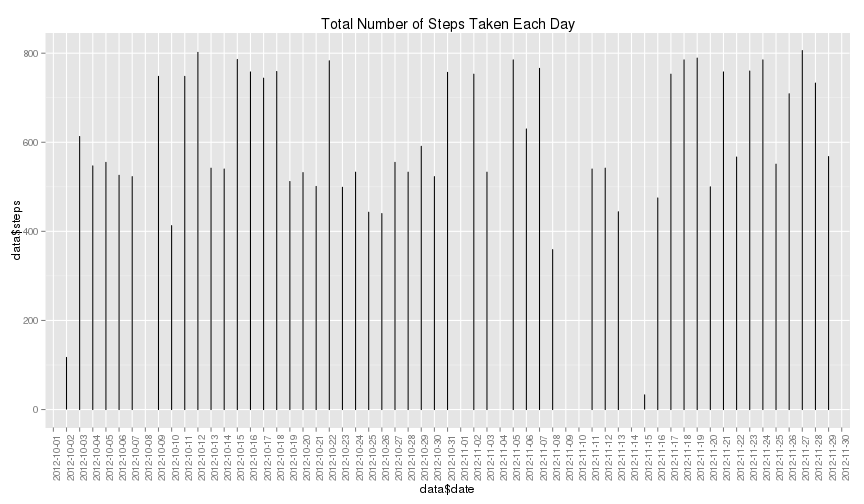
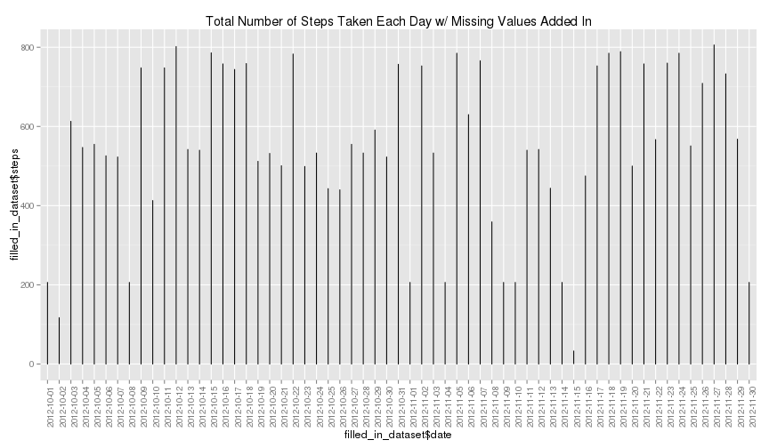
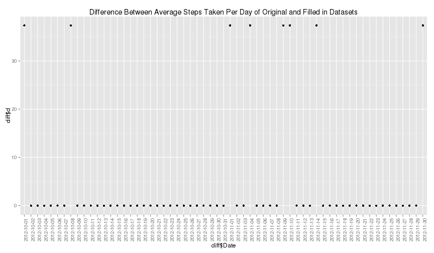
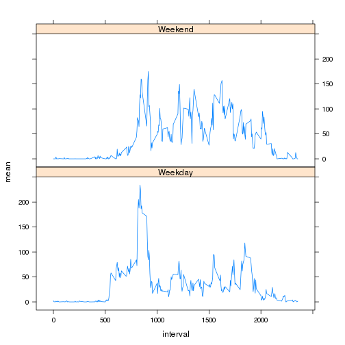

# Reproducible Research: Peer Assessment 1


## Loading and preprocessing the data

Load the data.  The dataset looks easy to work with and will not be processed further.

```r
setwd("/home/bmarx/docs/coursera/reproducibleresearch/project1/RepData_PeerAssessment1")
unzip("activity.zip")
data <- read.csv("activity.csv",header=TRUE)
```

## What is mean total number of steps taken per day?

Make a histogram of the total number of steps taken each day.

```r
library(ggplot2)
p <- qplot(data$date,data$steps,geom=c("line")) + labs(title="Total Number of Steps Taken Each Day")
p + theme(axis.text.x = element_text(angle=90))
```

 

Calculate and report the mean total number of steps taken per day.

```r
mean <- aggregate(data$steps,list(data$date),FUN="mean")
names(mean) <- c("Date","Mean")
mean
```

```
##          Date    Mean
## 1  2012-10-01      NA
## 2  2012-10-02  0.4375
## 3  2012-10-03 39.4167
## 4  2012-10-04 42.0694
## 5  2012-10-05 46.1597
## 6  2012-10-06 53.5417
## 7  2012-10-07 38.2465
## 8  2012-10-08      NA
## 9  2012-10-09 44.4826
## 10 2012-10-10 34.3750
## 11 2012-10-11 35.7778
## 12 2012-10-12 60.3542
## 13 2012-10-13 43.1458
## 14 2012-10-14 52.4236
## 15 2012-10-15 35.2049
## 16 2012-10-16 52.3750
## 17 2012-10-17 46.7083
## 18 2012-10-18 34.9167
## 19 2012-10-19 41.0729
## 20 2012-10-20 36.0938
## 21 2012-10-21 30.6285
## 22 2012-10-22 46.7361
## 23 2012-10-23 30.9653
## 24 2012-10-24 29.0104
## 25 2012-10-25  8.6528
## 26 2012-10-26 23.5347
## 27 2012-10-27 35.1354
## 28 2012-10-28 39.7847
## 29 2012-10-29 17.4236
## 30 2012-10-30 34.0938
## 31 2012-10-31 53.5208
## 32 2012-11-01      NA
## 33 2012-11-02 36.8056
## 34 2012-11-03 36.7049
## 35 2012-11-04      NA
## 36 2012-11-05 36.2465
## 37 2012-11-06 28.9375
## 38 2012-11-07 44.7326
## 39 2012-11-08 11.1771
## 40 2012-11-09      NA
## 41 2012-11-10      NA
## 42 2012-11-11 43.7778
## 43 2012-11-12 37.3785
## 44 2012-11-13 25.4722
## 45 2012-11-14      NA
## 46 2012-11-15  0.1424
## 47 2012-11-16 18.8924
## 48 2012-11-17 49.7882
## 49 2012-11-18 52.4653
## 50 2012-11-19 30.6979
## 51 2012-11-20 15.5278
## 52 2012-11-21 44.3993
## 53 2012-11-22 70.9271
## 54 2012-11-23 73.5903
## 55 2012-11-24 50.2708
## 56 2012-11-25 41.0903
## 57 2012-11-26 38.7569
## 58 2012-11-27 47.3819
## 59 2012-11-28 35.3576
## 60 2012-11-29 24.4688
## 61 2012-11-30      NA
```

Calculate and report the median total number of steps taken per day.

```r
median <- aggregate(data$steps,list(data$date),FUN="median")
names(median) <- c("Date","Median")
median
```

```
##          Date Median
## 1  2012-10-01     NA
## 2  2012-10-02      0
## 3  2012-10-03      0
## 4  2012-10-04      0
## 5  2012-10-05      0
## 6  2012-10-06      0
## 7  2012-10-07      0
## 8  2012-10-08     NA
## 9  2012-10-09      0
## 10 2012-10-10      0
## 11 2012-10-11      0
## 12 2012-10-12      0
## 13 2012-10-13      0
## 14 2012-10-14      0
## 15 2012-10-15      0
## 16 2012-10-16      0
## 17 2012-10-17      0
## 18 2012-10-18      0
## 19 2012-10-19      0
## 20 2012-10-20      0
## 21 2012-10-21      0
## 22 2012-10-22      0
## 23 2012-10-23      0
## 24 2012-10-24      0
## 25 2012-10-25      0
## 26 2012-10-26      0
## 27 2012-10-27      0
## 28 2012-10-28      0
## 29 2012-10-29      0
## 30 2012-10-30      0
## 31 2012-10-31      0
## 32 2012-11-01     NA
## 33 2012-11-02      0
## 34 2012-11-03      0
## 35 2012-11-04     NA
## 36 2012-11-05      0
## 37 2012-11-06      0
## 38 2012-11-07      0
## 39 2012-11-08      0
## 40 2012-11-09     NA
## 41 2012-11-10     NA
## 42 2012-11-11      0
## 43 2012-11-12      0
## 44 2012-11-13      0
## 45 2012-11-14     NA
## 46 2012-11-15      0
## 47 2012-11-16      0
## 48 2012-11-17      0
## 49 2012-11-18      0
## 50 2012-11-19      0
## 51 2012-11-20      0
## 52 2012-11-21      0
## 53 2012-11-22      0
## 54 2012-11-23      0
## 55 2012-11-24      0
## 56 2012-11-25      0
## 57 2012-11-26      0
## 58 2012-11-27      0
## 59 2012-11-28      0
## 60 2012-11-29      0
## 61 2012-11-30     NA
```


## What is the average daily activity pattern?

Make a time series plot of the 5-minute interval (x-axis) and the average number of steps taken, averaged across all days (y-axis)

```r
daily_pattern <- aggregate(data$steps ~ data$interval,list(data$date),FUN="mean")
names(daily_pattern) <- c("interval","mean")
plot(daily_pattern,type="l",main="Average Steps Taken Per Interval Over All Days")
```

 

Which 5-minute interval, on average across all the days in the dataset, contains the maximum number of steps?

```r
daily_pattern[daily_pattern$mean == max(daily_pattern$mean),]
```

```
##     interval  mean
## 104      835 206.2
```


## Imputing missing values

Calculate and report the total number of missing values in the dataset (i.e. the total number of rows with NAs)

```r
nrow(data)-sum(complete.cases(data))
```

```
## [1] 2304
```

Devise a strategy for filling in all of the missing values in the dataset. The strategy does not need to be sophisticated. For example, you could use the mean/median for that day, or the mean for that 5-minute interval, etc.

The mean value for the five minute interval over all days will be used.  This value was already calculated and is stored in daily_pattern.

Create a new dataset that is equal to the original dataset but with the missing data filled in.


```r
filled_in_dataset <- data
for (i in 1:nrow(filled_in_dataset)){
     if(is.na(filled_in_dataset[i,1])){
          filled_in_dataset[i,1] = daily_pattern[daily_pattern$interval == filled_in_dataset[i,3],2]
     }
}
```

Make a histogram of the total number of steps taken each day?

```r
library(ggplot2)
p <- qplot(filled_in_dataset$date,filled_in_dataset$steps,geom=c("line")) + labs(title="Total Number of Steps Taken Each Day w/ Missing Values Added In")
p + theme(axis.text.x = element_text(angle=90))
```

 

Calculate and report the mean total number of steps taken per day.

```r
filled_in_mean <- aggregate(filled_in_dataset$steps,list(filled_in_dataset$date),FUN="mean")
names(filled_in_mean) <- c("Date","Mean")
filled_in_mean
```

```
##          Date    Mean
## 1  2012-10-01 37.3826
## 2  2012-10-02  0.4375
## 3  2012-10-03 39.4167
## 4  2012-10-04 42.0694
## 5  2012-10-05 46.1597
## 6  2012-10-06 53.5417
## 7  2012-10-07 38.2465
## 8  2012-10-08 37.3826
## 9  2012-10-09 44.4826
## 10 2012-10-10 34.3750
## 11 2012-10-11 35.7778
## 12 2012-10-12 60.3542
## 13 2012-10-13 43.1458
## 14 2012-10-14 52.4236
## 15 2012-10-15 35.2049
## 16 2012-10-16 52.3750
## 17 2012-10-17 46.7083
## 18 2012-10-18 34.9167
## 19 2012-10-19 41.0729
## 20 2012-10-20 36.0938
## 21 2012-10-21 30.6285
## 22 2012-10-22 46.7361
## 23 2012-10-23 30.9653
## 24 2012-10-24 29.0104
## 25 2012-10-25  8.6528
## 26 2012-10-26 23.5347
## 27 2012-10-27 35.1354
## 28 2012-10-28 39.7847
## 29 2012-10-29 17.4236
## 30 2012-10-30 34.0938
## 31 2012-10-31 53.5208
## 32 2012-11-01 37.3826
## 33 2012-11-02 36.8056
## 34 2012-11-03 36.7049
## 35 2012-11-04 37.3826
## 36 2012-11-05 36.2465
## 37 2012-11-06 28.9375
## 38 2012-11-07 44.7326
## 39 2012-11-08 11.1771
## 40 2012-11-09 37.3826
## 41 2012-11-10 37.3826
## 42 2012-11-11 43.7778
## 43 2012-11-12 37.3785
## 44 2012-11-13 25.4722
## 45 2012-11-14 37.3826
## 46 2012-11-15  0.1424
## 47 2012-11-16 18.8924
## 48 2012-11-17 49.7882
## 49 2012-11-18 52.4653
## 50 2012-11-19 30.6979
## 51 2012-11-20 15.5278
## 52 2012-11-21 44.3993
## 53 2012-11-22 70.9271
## 54 2012-11-23 73.5903
## 55 2012-11-24 50.2708
## 56 2012-11-25 41.0903
## 57 2012-11-26 38.7569
## 58 2012-11-27 47.3819
## 59 2012-11-28 35.3576
## 60 2012-11-29 24.4688
## 61 2012-11-30 37.3826
```

Calculate and report the median total number of steps taken per day.

```r
filled_in_median <- aggregate(filled_in_dataset$steps,list(filled_in_dataset$date),FUN="median")
names(filled_in_median) <- c("Date","Median")
filled_in_median
```

```
##          Date Median
## 1  2012-10-01  34.11
## 2  2012-10-02   0.00
## 3  2012-10-03   0.00
## 4  2012-10-04   0.00
## 5  2012-10-05   0.00
## 6  2012-10-06   0.00
## 7  2012-10-07   0.00
## 8  2012-10-08  34.11
## 9  2012-10-09   0.00
## 10 2012-10-10   0.00
## 11 2012-10-11   0.00
## 12 2012-10-12   0.00
## 13 2012-10-13   0.00
## 14 2012-10-14   0.00
## 15 2012-10-15   0.00
## 16 2012-10-16   0.00
## 17 2012-10-17   0.00
## 18 2012-10-18   0.00
## 19 2012-10-19   0.00
## 20 2012-10-20   0.00
## 21 2012-10-21   0.00
## 22 2012-10-22   0.00
## 23 2012-10-23   0.00
## 24 2012-10-24   0.00
## 25 2012-10-25   0.00
## 26 2012-10-26   0.00
## 27 2012-10-27   0.00
## 28 2012-10-28   0.00
## 29 2012-10-29   0.00
## 30 2012-10-30   0.00
## 31 2012-10-31   0.00
## 32 2012-11-01  34.11
## 33 2012-11-02   0.00
## 34 2012-11-03   0.00
## 35 2012-11-04  34.11
## 36 2012-11-05   0.00
## 37 2012-11-06   0.00
## 38 2012-11-07   0.00
## 39 2012-11-08   0.00
## 40 2012-11-09  34.11
## 41 2012-11-10  34.11
## 42 2012-11-11   0.00
## 43 2012-11-12   0.00
## 44 2012-11-13   0.00
## 45 2012-11-14  34.11
## 46 2012-11-15   0.00
## 47 2012-11-16   0.00
## 48 2012-11-17   0.00
## 49 2012-11-18   0.00
## 50 2012-11-19   0.00
## 51 2012-11-20   0.00
## 52 2012-11-21   0.00
## 53 2012-11-22   0.00
## 54 2012-11-23   0.00
## 55 2012-11-24   0.00
## 56 2012-11-25   0.00
## 57 2012-11-26   0.00
## 58 2012-11-27   0.00
## 59 2012-11-28   0.00
## 60 2012-11-29   0.00
## 61 2012-11-30  34.11
```

Do these values differ from the estimates from the first part of the assignment? 

```r
diff <- c()
for (i in 1:nrow(mean)){
     if(is.na(mean[i,2])){
          diff <- rbind(diff,filled_in_mean[i,2]-0)
     }
     else{
          diff <- rbind(diff,filled_in_mean[i,2]-mean[i,2])
     }
}
diff <- cbind(mean,diff)
names(diff) <- c("Date","Mean","d")
p <- qplot(diff$Date,diff$d,geom=c("point")) + labs(title="Difference Between Average Steps Taken Per Day of Original and Filled in Datasets")
p + theme(axis.text.x = element_text(angle=90))
```

 

What is the impact of imputing missing data on the estimates of the total daily number of steps?

## Are there differences in activity patterns between weekdays and weekends?

Create a new factor variable in the dataset with two levels – “weekday” and “weekend” indicating whether a given date is a weekday or weekend day.


```r
library(lattice)
data$date <- as.Date(data$date)
day_type <- c()
for (i in 1:nrow(data)){
     if(weekdays(data[i,2]) == "Saturday" || weekdays(data[i,2]) == "Sunday"){
          day_type = rbind(day_type,"Weekend")
     }
     else{
          day_type = rbind(day_type,"Weekday")
     }
}
data <- cbind(data,day_type)
```

Make a panel plot containing a time series plot (i.e. type = "l") of the 5-minute interval (x-axis) and the average number of steps taken, averaged across all weekday days or weekend days (y-axis).


```r
weekdays <- data[data$day_type == "Weekday",]
weekends <- data[data$day_type == "Weekend",]

weekday_avg <- aggregate(weekdays$steps ~ weekdays$interval,list(weekdays$date),FUN="mean")
names(weekday_avg) <- c("interval","mean")

weekend_avg <- aggregate(weekends$steps ~ weekends$interval,list(weekends$date),FUN="mean")
names(weekend_avg) <- c("interval","mean")

weekday_avg <- cbind(weekday_avg,rep("Weekday",nrow(weekday_avg)))
names(weekday_avg) <- c("interval","mean","day_type")
weekend_avg <- cbind(weekend_avg,rep("Weekend",nrow(weekend_avg)))
names(weekend_avg) <- c("interval","mean","day_type")

combined <- rbind(weekday_avg,weekend_avg)
xyplot(mean~interval|day_type,data=combined,layout=c(1,2),type="l")
```

 


